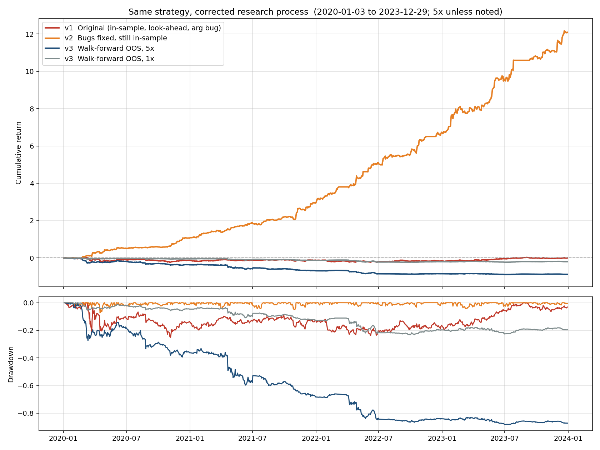

# Statistical-Arbitrage-Back-tester
Basic Statistical Arbitrage pairs trading strategy bot, backtested on cointegrated S&amp;P 500 pairs from 2018-2023

## Research process update

The original backtest (v1) selected pairs and fit hedge ratios on the full 2018-2023 sample and had a same-bar look-ahead and an argument-order bug. Fixing the bugs (v2) made results look *better* (Sharpe ~4), which exposed the in-sample fit as the dominant bias. v3 re-estimates everything walk-forward (2y formation / 6m trading, pairs picked by cointegration p-value only, frozen hedge ratio and spread stats while trading).

| Version (2020-2023, 5x unless noted) | Cum. return | Sharpe | Max DD |
|---|---|---|---|
| v1 Original (in-sample, look-ahead, arg bug) | +0.3% | 0.10 | -25% |
| v2 Bugs fixed, still in-sample | +1209% | 3.99 | -7% |
| v3 Walk-forward OOS, 5x | -87% | -1.38 | -88% |
| v3 Walk-forward OOS, 1x | -19% | -0.78 | -23% |

A nested parameter search (entry/exit z, p-cutoff, chosen on formation data only) did not help (1x Sharpe -1.04). Conclusion: pairs cointegrated in one 2-year window of mega-cap prices do not stay cointegrated out of sample; the earlier edge was in-sample fit. Next: sector-matched pairs, log prices, rolling hedge ratio.

Reproduce: `PYTHONPATH=src python src/walk_forward.py`, `src/tune_walk_forward.py`, then `src/compare.py`. v1/v2 return series in `results/` were generated from the original commit (`e481400`) and the fixed `main.py`.
